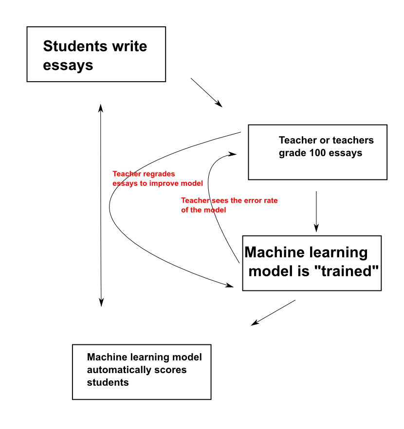

# New Methods to Grade Student Essay and Short-Answer Responses
## Vik Paruchuri
## Equirio

---
= data-x="0" data-y="0" data-scale="2"

## Before we start

* Follow along at vikparuchuri.github.io/educause

### Who am I?
* Founder at Equirio
* vik@equirio.com
* [LinkedIn](linkedin.com/in/vikparuchuri)

### What have I done?
* Machine Learning
* edX

---
= data-x="1000" data-y="1000" data-scale="2"

## Goals

* Discuss new methods of assessing student essays and short answers.
* Identify how each method works.
* Discuss strengths and advantages of each.

---
= data-x="2000" data-y="0" data-scale="2"

## What is edX?

* edX (edx.org) is an educational non-profit created in May 2012.
* Two major components:
  * edX platform learning management system (LMS)
  * edX studio content management system (CMS)
  * Together, enable authoring and delivery of courses at extremely large scale.
* Have hosted 30+ courses in subject areas from physics to justice, with a larger number upcoming.
* Recenly passed the 1 million student mark.
* Platform and all software today [open source](github.com/edx) and coded in Python.

---
= data-x="3000" data-y="2000" data-scale="1"

## Assessments on the edX platform

* When edX launched, assessments were restricted to "closed-choice" response.
* 
* 

---
= data-x="4000" data-y="0" data-scale="2"

## How do we support humanities courses?
### Challenges
* Need support for free-text responses.
  * Richer assessments allow for varied instructional and learning styles.
* Short answer responses also useful for STEM courses.

### Ideas

* Automated essay scoring (AES)
* Peer assessment
* Self assessment
* A way to use them together

---
= data-x="5000" data-y="1000" data-scale="2"

## Technique 1:  AES
* Idea advanced by [Ellis Page](http://en.wikipedia.org/wiki/Ellis_Batten_Page) starting in 1966.
* Gained a lot of steam in the 1990s and 2000s.
* Currently offered by [Educational Testing Service](http://www.ets.org/), [Pearson](http://www.pearson.com/), and [CTB/McGraw-Hill](http://www.ctb.com/ctb.com/control/main), among others.
* Often used as a "second reader" for high stakes tests.

---
= data-x="6000" data-y="2000" data-scale="2"

## How does it work?


---
= data-x="7000" data-y="0" data-scale="1"

## What does the machine model look at?

### Machines can't directly understand text
* Need to convert the text into numbers, which machines can work with.

### Features
* All objects can have features.
* Features can all be quantified.
* Example: your apartment, how many bedrooms it has, and how much rent you pay.
* By figuring out what patterns of features mean, we can make predictions.

---
= data-x="8000" data-y="1000" data-scale="1"

## Example

Survey asks *why do you want to learn about machine learning?*, and *how interested are you on a 0-2 scale?*:

<div>
<table border="1" class="dataframe table display">
<thead>
<tr><th>number</th><th>response</th><th>score</th></tr>
</thead>
<tbody>
<tr><td>1</td><td>I like solving interesting problems.</td><td>2</td></tr>
<tr><td>2</td><td>What is machine learning?</td><td>0</td></tr>
<tr><td>3</td><td>I'm not sure.</td><td>0</td></tr>
<tr><td>4</td><td>Machine learning predicts everything!</td><td>2</td></tr>
</tbody>
</table>

  <script>
    $('.table').dataTable({
        "bPaginate": false,
        "bLengthChange": false,
        "bSort": false,
        "bStateSave": true,
        "sScrollY": 200,
        "sScrollX": 500,
        "bFilter": true,
        "bInfo": false,
        "aLengthMenu": [[50, 100, -1], [50, 100, "All"]],
        "iDisplayLength": 4,
    });
    </script><br/>
</div>

What if we get a survey where the response is *I really like solving problems.  Machine learning is very useful* , but it is missing a score?

---
= data-x="9000" data-y="0" data-scale="1"

## Potential features

* Presence/absence of the phrase `solving problems`. (0 if absent, 1 if present)
* Number of sentences.
* Presence/absence of `machine learning`.
* Average word length.
* Presence/absence of `machine`.

---
= data-x="10000" data-y="1000" data-scale="2"

## Making predictions

* Use a machine learning [algorithm](http://en.wikipedia.org/wiki/Supervised_learning), such as a random forest, or a linear regression.
* Give it features and human scores in order to train it.
* Training creates a model, which can predict the scores for new essays.
* To predict, take a new essay, turn it into a sequence of features, and then ask our model to score it for us.

---
= data-x="10000" data-y="1000" data-scale="2"

## What is the model doing?

* Trying to mimic an expert human scorer.
* Figuring out the criteria a teacher uses to score an essay.
* Applying that knowledge to scoring future essays.
* Model can be updated over time with new human scoring.

---
= data-x="11000" data-y="2000" data-scale="2"

## Applying AES


---
= data-x="12000" data-y="0" data-scale="2"

## Sample Rubric

```
Topicality
0 points - Student is off topic
1 point - Student stays on topic

Photosynthesis
0 points - Incorrectly defines photosynthesis
1 points - Partially correct definition
2 points - Fully correct definition
```

* Rubric can be customized by the instructor.
* Score on each rubric dimension shown to students.

---
= data-x="13000" data-y="1000" data-scale="2"

## edX AES Flow



---
= data-x="14000" data-y="0" data-scale="2"

## Low "confidence" re-grading

* edX allows teachers to regrade essays that AES has scored poorly.
* Machine models gives you a score and a confidence value from 0% - 100% associated with that score.
* Low confidence papers are shown to the teacher to re-score.
* Called <i><a href="http://en.wikipedia.org/wiki/Active_learning_(machine_learning)">active learning</a></i>.

---
= data-x="15000" data-y="1000" data-scale="1"

## AES Overview

### Strengths
* Can give very quick scores to students.
* Allows students to submit drafts and iterate on their work.
* Can save teacher effort.

### Weaknesses
* Can't give thoughtful, directed, feedback.
* Potential to be "gamed."
* Needs a lot of upfront grading to be done by the teacher.

---
= data-x="16000" data-y="2000" data-scale="1"

## AES Best Practices

* Use in conjunction with another type of grading (more on this later).
* Construct good rubrics.
* Ensure that grading is done consistently.
* Re-grade papers as needed.

---
= data-x="17000" data-y="0" data-scale="2"

## Technique 2: Peer Assessment

* Students submit papers.
* Teacher grades "calibration" essays.
* Students perform calibration.
* Each student receives grades, rubric scores, and written feedback from 3 others.
* Scores shown to student.

---
= data-x="18000" data-y="0" data-scale="1"

## Peer Assessment Diagram


---
= data-x="19000" data-y="1000" data-scale="2"

## Peer Assessment Overview

### Strengths
* Students get a lot of direct feedback.
* Students learn from grading each other.

### Weaknesses
* Teacher has to grade calibration papers.
* Can be imbalances in number of graders and number of papers.
* Inconsistent quality of grading.

---
= data-x="20000" data-y="2000" data-scale="2"

## Peer Assessment Best Practices

* Use calibration.
* Match students based on quality of feedback.
* Incentivize peer grading.
* Manage the process and communicate with students.

---
= data-x="21000" data-y="0" data-scale="1"

## Technique 3: Self Assessment

* Students submit papers.
* Students rate themselves on a rubric.

---
= data-x="22000" data-y="1000" data-scale="1"

## Self Assessment Overview

### Strengths
* No effort to setup on the part of course staff.
* Students get instant feedback.
* Unlimited retries.

### Weaknesses
* Score may be unreliable.
* Students don't get feedback.

---
= data-x="23000" data-y="2000" data-scale="1"

## Self Assessment Best Practices

* Use in conjunction with another type of grading.
* Give students a way to share with each other.

---
= data-x="24000" data-y="0" data-scale="2"

## Pulling it all together

### Chaining
* Combine by allowing teachers to setup "chains."
* Student gets one type of grading, and moves to next depending on score.
* Saves effort, maximizes feedback.
* Use same rubric for all grading types.

---
= data-x="25000" data-y="0" data-scale="2"

## Chaining Diagram


---
= data-x="25000" data-y="1000" data-scale="2"

## Future Ideas

* AES is used as a way to give students iterative feedback before submitting a final draft to a teacher for a full evaluation.
* AES systems experiment with giving teachers information, and allowing them to regrade and customize grading.
* Automatically route students to peer graders based on performance.
* Incentivize students to self assess accurately.
* Automated systems pre-score essays, and identify students who might need teacher intervention.
* Small group discussions are tried in combination with various grading techniques.
* Automated scoring of alternative types of media, like videos.
